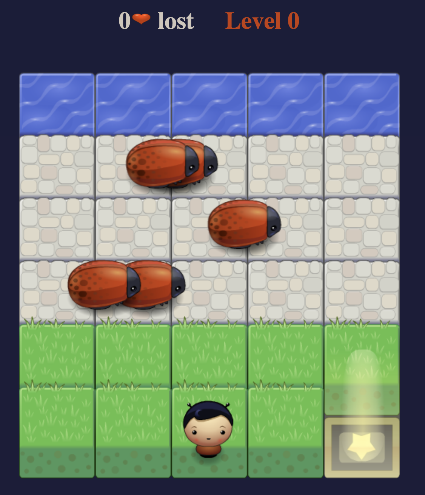

# Classic Arcade Game

## Memory Game

A Frogger Arcade Game built with Vanilla JavaScript without any external libraries. The idea of this game is to try and reach  the Water without trying to  touch a Bug! or you loose lives.

# Install and run
* In order to play the game download/clone all the files in your computer.
* Double-click the ìndex.html file in your browser.

# Game Rules

* The player can move left, right, up and down. The movement of the player is done with the four arrows keys (up, down, left, right) 
* The enemies (bugs) move in varying speeds on the paved block portion of the scene.
* The player must reach the water without colliding into any of the bugs.
* You have unlimited lives and by colliding with any bug, you will lose a live
* Every time the player reaches the water the character moves back to the start position and starts the next level(there are up to 3 levels before the game ends).
* You only win when you get to level 3 and finish that level, it is all about trying not to loose as many lives as possible before the game ends which is after level 3. HAVE FUN!!!

# Players:
A player can be choosen on the yellow star box on the game board using four arrows keys (up, down, left, right).

Game board image:

# Resources
* W3Schools
* MDN Web Docs
* UDACITY teaching material

